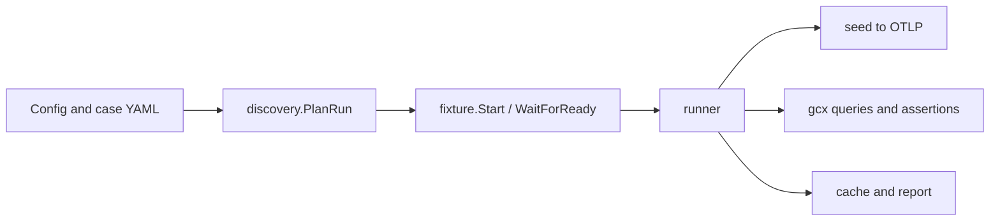

# Contributing to OATs

This is the starting point for contributing to OATs. It covers how to choose and
prepare a change, the development workflow, and the repository architecture,
then links to detailed references for further information.

## Start here

```sh
mise run build       # build oats with the gcx version from mise.toml
mise run test        # unit and integration tests (excludes tests/e2e)
mise run e2e-test    # real-stack e2e cases; requires Docker or Podman
mise run lint        # Flint's aggregate lint/check command
mise run check       # lint + test
```

For the user-facing surface, read [CLI](docs/cli.md), [case reference](docs/case-reference.md),
[CI guidance](docs/ci.md), and [upgrading](UPGRADING.md). The root
[AGENTS.md](AGENTS.md) contains the concise coding-agent instructions. Durable
architecture and product decisions are recorded in the
[architecture decision records](docs/adr/README.md).

## Choosing a change

- Look for an existing issue or discussion before starting a non-trivial
  change. If there is no suitable issue, open one first so the scope and
  expected behavior can be agreed on with the maintainers.
- For smaller tasks, browse the [help wanted issues](https://github.com/grafana/oats/issues?q=state%3Aopen%20label%3A%22help%20wanted%22)
  for work that is ready to pick up.
- Claim the work in the issue or discussion, then keep the pull request focused
  on that change. Avoid bundling unrelated cleanup with a feature or fix.
- For architectural or product changes, read the relevant
  [architecture decision records](docs/adr/README.md) and add or update an ADR
  when the decision should remain durable.

## Submitting a pull request

Before opening or updating a pull request:

1. Run the relevant tests and `mise run lint` locally.
2. Use [signed commits](https://docs.github.com/repositories/configuring-branches-and-merges-in-your-repository/managing-protected-branches/about-protected-branches#require-signed-commits).
   See GitHub's [commit signature setup](https://docs.github.com/authentication/managing-commit-signature-verification/about-commit-signature-verification)
   and [verification guidance](https://docs.github.com/authentication/troubleshooting-commit-signature-verification/checking-your-commit-and-tag-signature-verification-status).
   Do not bypass hooks with `--no-verify`.
3. Include a concise summary, the validation performed, and any follow-up work
   in the pull request description.
4. Keep review updates additive where possible. Avoid force-pushing review
   changes unless repairing or restacking history requires it.

Sign Grafana's [Contributor License Agreement (CLA)](https://cla-assistant.io/grafana/oats)
before submitting if possible. The CLA bot will report whether the contributor
agreement is complete; address its request before the pull request can be merged.

## Architecture at a glance

The normal run flows left to right:



| Area                                | Responsibility                                                         | Start with               |
| ----------------------------------- | ---------------------------------------------------------------------- | ------------------------ |
| `casefile/`                         | v3 YAML case/config data and validation                                | `casefile/case.go`       |
| `discovery/`                        | config loading, filtering, and fixture-boot grouping                   | `discovery/discovery.go` |
| `fixture/`                          | compose/k3d lifecycle, readiness, endpoints, and parallel-safety gates | `fixture/fixture.go`     |
| `runner/`                           | case execution: seed, poll, assertions, cache, and reporting           | `runner/runner.go`       |
| `seed/`                             | inline OTLP and application-input seeding                              | `seed/seed.go`           |
| `engine/` / `signalcmd/`            | gcx invocation and signal-specific command construction                | `engine/gcx.go`          |
| `report/`                           | text/NDJSON event stream and GitHub annotations                        | `report/event.go`        |
| `internal/cli/`                     | Cobra commands, flags, env mapping, and orchestration                  | `internal/cli/main.go`   |
| `internal/legacyyaml/` / `migrate/` | legacy schema parsing and v2→v3 migration only                         | `migrate/migrate.go`     |
| `tests/e2e/`                        | black-box cases run against real stacks and tools                      | `tests/e2e/e2e_test.go`  |

The current format has one schema version (`meta.version: 3`). Cases carry their
own fixture; OATS derives fixture-boot groups, boots each fixture once, and runs
the group's cases serially. Different groups may run concurrently when the
fixture safety gate allows it.

## CLI, environment, and gcx

- Every run flag has an `OATS_` environment equivalent; command-line values win.
  The complete table is in [CLI reference](docs/cli.md).
- `gcx` is a separate executable. OATS does not bundle it into the oats binary.
  Release and mise builds embed the pinned gcx version so a missing default gcx
  can be downloaded, checksum-verified, and cached. `--gcx-version` explicitly
  selects a release; `--gcx-download never` (or `OATS_GCX_DOWNLOAD=never`) keeps
  CI and air-gapped runs from downloading.
- The pin is read from `mise.toml` by `scripts/gcx-version.sh`. Local builds use
  `scripts/build-oats.sh`; local tool setup uses `scripts/build-local-tools.sh`;
  GoReleaser receives the same value through `GCX_VERSION` in the release
  workflow. Do not hard-code a second gcx version in a script or workflow.
- `OATS_GHA_ANNOTATIONS` controls the optional GitHub Actions error annotations
  emitted by the text reporter. See [CI guidance](docs/ci.md).

## Test and CI map

- `mise run test` runs all Go packages except `tests/e2e`.
- `tests/e2e` is a data-driven harness. Each case directory has a `test.yaml`
  plus its generated/config/fixture files; use `OATS_E2E_FILTER` to narrow a
  local run. The harness builds the real oats and gcx tools and uses the
  selected Docker or Podman engine for Compose fixtures; k3d remains
  Docker-backed.
- `.github/workflows/lint.yml`, `build.yml`, and `test.yml` provide fast PR
  feedback. `.github/workflows/e2e_test.yml` runs the real-stack matrix and ends
  in one `e2e` gate job. Release builds use `.github/workflows/release.yml` and
  `.goreleaser.yml`.
- Examples are part of the build/e2e contract, not documentation-only snippets.
  Keep their compose files, Dockerfiles, manifests, scripts, and case files
  together when adding or changing an example.

## Common gotchas

1. **Do not reintroduce config-level suites.** The v3 config is `meta` + `cases`
   - optional cache; fixture data belongs on each case.
2. **Do not use `docker-compose`.** The supported command is `docker compose`;
   the compose helper owns project names and generated ports for isolation.
3. **Cache keys do not hash fixture contents.** A floating app image tag can
   produce a stale green result. Pin image digests or avoid persisting the cache
   until the image digest is included in `cache.Key.Extra`.
4. **Keep gcx and oats version wiring together.** If the mise pin changes,
   `scripts/gcx-version.sh`, local builds, releases, and CI should all continue
   to derive the same value.
5. **Prefer focused changes against the current integration base.** Run the
   relevant unit tests and lint before pushing; use signed commits and normal
   pushes, and avoid force-pushing review updates unless a true restack requires
   it.
