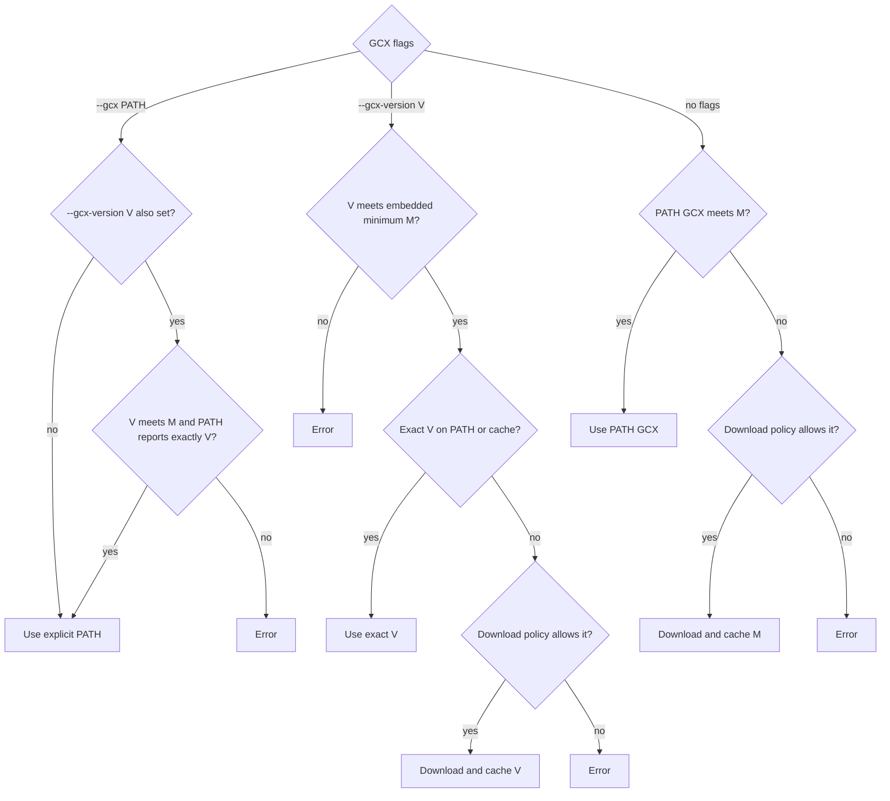

# CLI reference

`oats` runs the cases declared by an `oats-config.yaml`. For the config and case
shapes see [case-reference.md](case-reference.md); for CI see [ci.md](ci.md).

## Config discovery

Every command that needs the config looks for **`oats-config.yaml`** in the
current directory and then each parent directory (like `git`), so you can run
`oats` from anywhere inside a project. Pass `--config <path>` to use a specific
file instead.

## GCX resolution

Release and mise-built `oats` binaries contain the minimum gcx version pinned
by this repository. If the default `gcx` command is missing, older than that
minimum, or does not report a parsable version, `oats` downloads and caches
that verified release when the fallback policy is `auto`. Set
`--gcx-download never` (or `OATS_GCX_DOWNLOAD=never`) for air-gapped or strict
CI environments; an absent or too-old PATH binary then causes an error. The
default is `never` when mise is detected (mise on `PATH`, a mise environment
variable, or an executable installed under mise), and `auto` otherwise. An
explicit `--gcx <path>` bypasses the minimum-version check. `--gcx-version V`
selects an exact version, reusing a matching PATH or cached binary before
downloading it. If both `--gcx` and `--gcx-version` are supplied, the explicit
binary must report exactly the requested version; it is never replaced by a
download. The requested version must meet OATs' embedded minimum unless
`--gcx` is used without `--gcx-version` as an explicit escape hatch.

Only the minimum version is enforced for default PATH selection: newer PATH
versions are accepted rather than imposing a maximum that would force `oats`
and `gcx` releases to stay in lockstep. The GCX output formats consumed by
`oats` still need to be covered by the OATs parsers and tests as they evolve.

Let `M` be OATs' embedded minimum GCX version:

| Selection                                     | Resolution                                                                                   |
| --------------------------------------------- | -------------------------------------------------------------------------------------------- |
| Neither `--gcx` nor `--gcx-version`           | Use PATH GCX when its version is at least `M`; otherwise apply the download policy           |
| `--gcx PATH`                                  | Use `PATH` directly; the minimum check is bypassed                                           |
| `--gcx-version V`                             | Require `V >= M`; use an exact PATH match, then the cache, then download according to policy |
| `--gcx PATH --gcx-version V`                  | Require `PATH` to report exactly `V` and `V >= M`; never download or replace it              |
| `--gcx-version V` with `--gcx-download never` | Use an exact PATH/cache match or fail                                                        |



The download policy is selected from `--gcx-download` (highest priority), then
`OATS_GCX_DOWNLOAD`. When neither is set, it defaults to `never` in mise
environments and `auto` otherwise. This avoids downloading a second GCX when
mise is already managing the tool; set the flag or environment variable to
override the default.

## Commands

### `oats [paths...]` / `oats run [paths...]`

Run the cases. Bare `oats` is an implicit `run`; the explicit `run` subcommand is
identical. With no positional args every case in the config runs; positional
**paths** (files or directories) restrict the run to cases at or under them —
they scope *which* cases run, they do not change where the config loads from.

```sh
oats                              # run every case
oats payments/                    # only cases under payments/
oats payments/checkout/           # only cases under payments/checkout/
oats --tags traces                # filter by tag
oats --parallel 4                 # run parallel-safe suites concurrently
```

A run boots each derived fixture group, seeds it, then polls every assertion
until it passes or `--timeout` elapses. Exit code is non-zero if any case fails.

Every flag has an environment-variable equivalent: uppercase the flag name,
replace hyphens with underscores, and prefix it with `OATS_`. Command-line
flags take precedence over environment variables. For example,
`--gcx /opt/tools/gcx` is equivalent to `OATS_GCX=/opt/tools/gcx`.

Compose fixtures use the host container engine selected by
`--container-runtime` (or `OATS_CONTAINER_RUNTIME`). `auto` prefers Podman and
falls back to Docker; selecting `podman` or `docker` explicitly never silently
falls back. k3d fixtures currently require Docker.

The builtin Compose fixture uses `docker.io/grafana/otel-lgtm:latest`. Select a
different tag with `--lgtm-version 0.12.2` or
`OATS_LGTM_VERSION=0.12.2`. To override the entire image reference instead,
set `LGTM_IMAGE`, either in the process environment:

```sh
LGTM_IMAGE=registry.example.com/mirror/otel-lgtm:0.12.2 oats
```

or on an individual fixture:

```yaml
fixture:
  compose:
    env:
      - LGTM_IMAGE=registry.example.com/mirror/otel-lgtm:0.12.2
```

An explicitly set `--lgtm-version` / `OATS_LGTM_VERSION` takes precedence over
`LGTM_IMAGE`; a fixture `env` value takes precedence over the process
environment.

GCX is resolved according to the [GCX resolution](#gcx-resolution) policy.

Flags:

| Flag                        | Environment variable              | Default                                                            | Meaning                                                                                    |
| --------------------------- | --------------------------------- | ------------------------------------------------------------------ | ------------------------------------------------------------------------------------------ |
| `--config`                  | `OATS_CONFIG`                     | `oats-config.yaml`, searched from current working directory upward | config file to load                                                                        |
| `--tags`                    | `OATS_TAGS`                       | all                                                                | comma-separated tags; a case runs if it matches any                                        |
| `--parallel`                | `OATS_PARALLEL`                   | `1`                                                                | fixture groups to run concurrently when fixture isolation allows                           |
| `--fail-fast`               | `OATS_FAIL_FAST`                  | `false`                                                            | stop scheduling further cases after the first failure                                      |
| `--timeout`                 | `OATS_TIMEOUT`                    | `30s`                                                              | per-assertion timeout — each assertion is retried until it passes or this elapses          |
| `--interval`                | `OATS_INTERVAL`                   | `500ms`                                                            | polling interval between assertion retries                                                 |
| `--absent-timeout`          | `OATS_ABSENT_TIMEOUT`             | `10s`                                                              | window an `absent` assertion must stay empty to pass                                       |
| `--seed-settle`             | `OATS_SEED_SETTLE`                | `2s`                                                               | wait after seeding before the first assertion                                              |
| `--no-cache`                | `OATS_NO_CACHE`                   | `false`                                                            | ignore the skip-when-unchanged cache for this run                                          |
| `--cache-dir`               | `OATS_CACHE_DIR`                  | platform user cache/state directory + `/oats`                      | directory for the skip-when-unchanged cache                                                |
| `--format`                  | `OATS_FORMAT`                     | `text`                                                             | output format: `text` or `ndjson`                                                          |
| `--gcx`                     | `OATS_GCX`                        | `gcx`                                                              | path to the gcx binary (`PATH`-resolved if a bare name)                                    |
| `--gcx-version`             | `OATS_GCX_VERSION`                | —                                                                  | require this exact gcx version, using PATH/cache before downloading (for example, `0.4.3`) |
| `--gcx-download`            | `OATS_GCX_DOWNLOAD`               | `auto` (`never` when mise is detected)                             | download policy for missing/incompatible GCX: `auto` or `never`                            |
| `--gcx-context`             | `OATS_GCX_CONTEXT`                | derived                                                            | gcx context to query (otherwise derived from the fixture endpoint)                         |
| `--lgtm-version`            | `OATS_LGTM_VERSION`               | `latest`                                                           | grafana/otel-lgtm version used by the builtin Compose fixture                              |
| `--container-runtime`       | `OATS_CONTAINER_RUNTIME`          | `auto`                                                             | Compose engine: prefer Podman, or explicitly use `docker` / `podman`                       |
| `--app-host` / `--app-port` | `OATS_APP_HOST` / `OATS_APP_PORT` | `localhost` / `8080`                                               | where to drive `input` requests when a fixture doesn't resolve the app endpoint itself     |
| `--otlp-http`               | `OATS_OTLP_HTTP`                  | `http://localhost:4318`                                            | OTLP/HTTP base URL for the `inline-otlp` seed                                              |
| `--verbose`                 | `OATS_VERBOSE`                    | `0`                                                                | increase verbosity (`1`–`3` are the useful levels)                                         |

The deprecated hidden aliases `--list` and `--migrate` also accept
`OATS_LIST` and `OATS_MIGRATE`. `oats list --config` uses `OATS_CONFIG`, and
`oats cache clear --cache-dir` uses `OATS_CACHE_DIR`.

### `oats list`

Print the resolved run plan — the derived fixture groups and the cases each
expands to — and exit without executing anything. Honors `--config` and the same
discovery. Useful to confirm globs and fixtures before a run.

### `oats migrate <path>`

Convert legacy (schema-2) OATS yaml to the v3 shape.

- **File** → prints one self-contained v3 case (including its `fixture:` block)
  to stdout; warnings about lossy/dropped fields go to stderr.
- **Directory** → migrates every legacy case found under it *in place* (each file
  is rewritten as its v3 equivalent, honoring `.oatsignore` and skipping
  templates) and writes an `oats-config.yaml` listing them explicitly. A summary
  and per-file warnings go to stderr; nothing to stdout.

```sh
oats migrate ./old-case.yaml > new-case.yaml   # one file
oats migrate .                                 # whole tree, in place
```

Legacy docker-compose/kubernetes fixtures become case-local `fixture:` blocks.
Migration is best-effort: review the warnings (e.g. multi-entry matrices and
`compose-logs` are not auto-converted).

### `oats cache clear`

Delete all cached results under `--cache-dir` (default: the platform user
cache/state directory plus `/oats`; `XDG_STATE_HOME` wins on Unix).
The cache lets a re-run skip cases whose `(case, fixture, gcx version, oats
version)` are unchanged and previously passed; clear it to force a full run.

### `oats version`

Print the oats version and exit.
